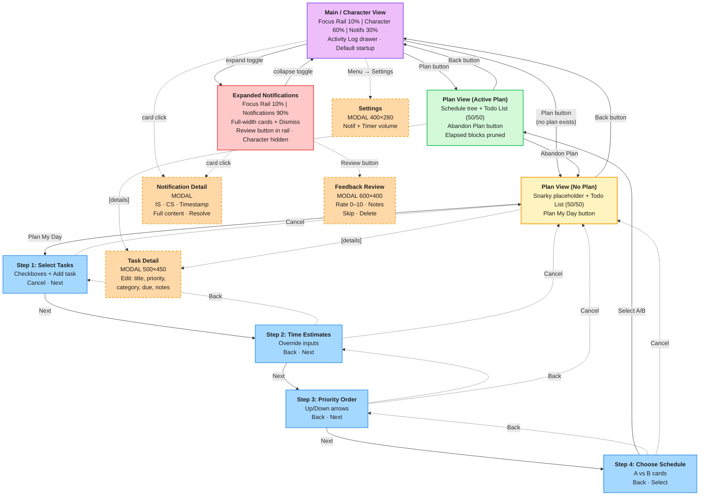

# UI Navigation Map

Diagram of all views and navigation flows in the Cue UI.

## Legend

| Style | Meaning |
|---|---|
| Solid border | Full-screen view (occupies center area or replaces columns) |
| Dashed border | Modal dialog (blocks main window) |
| Solid arrow | Primary navigation (forward flow) |
| Dotted arrow | Back / Cancel / modal open |
| Purple | Character view (default) |
| Green | Plan view (active plan) |
| Yellow | Plan view (no plan) |
| Blue | Wizard steps |
| Red | Expanded notifications |
| Orange | Modal dialogs |
